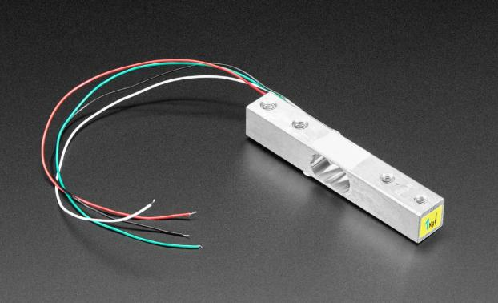
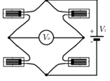
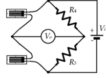
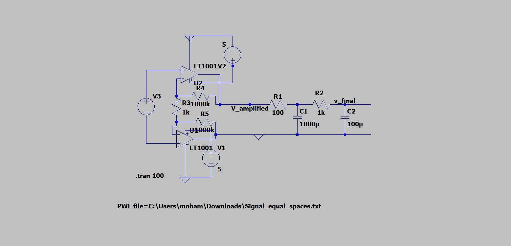
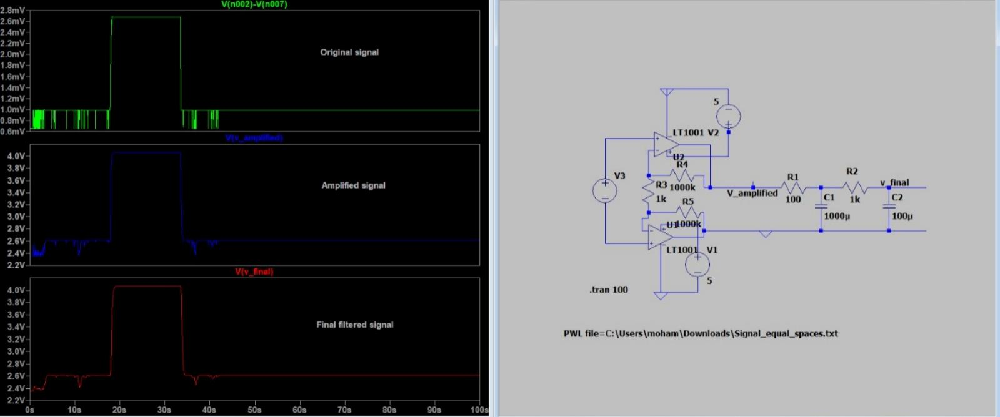
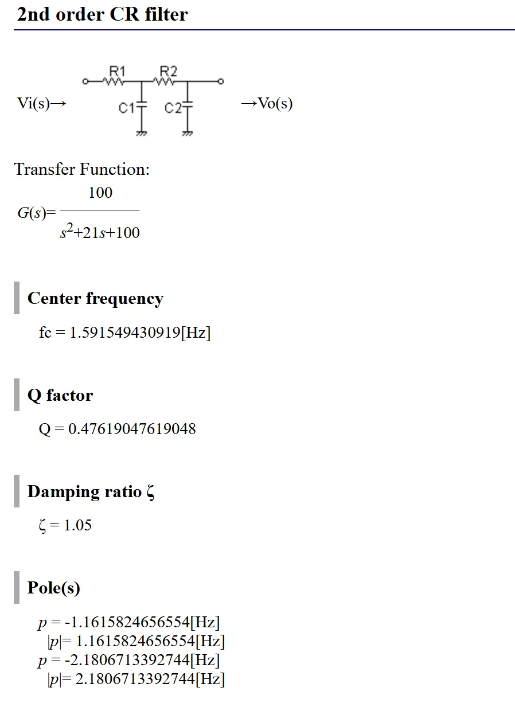
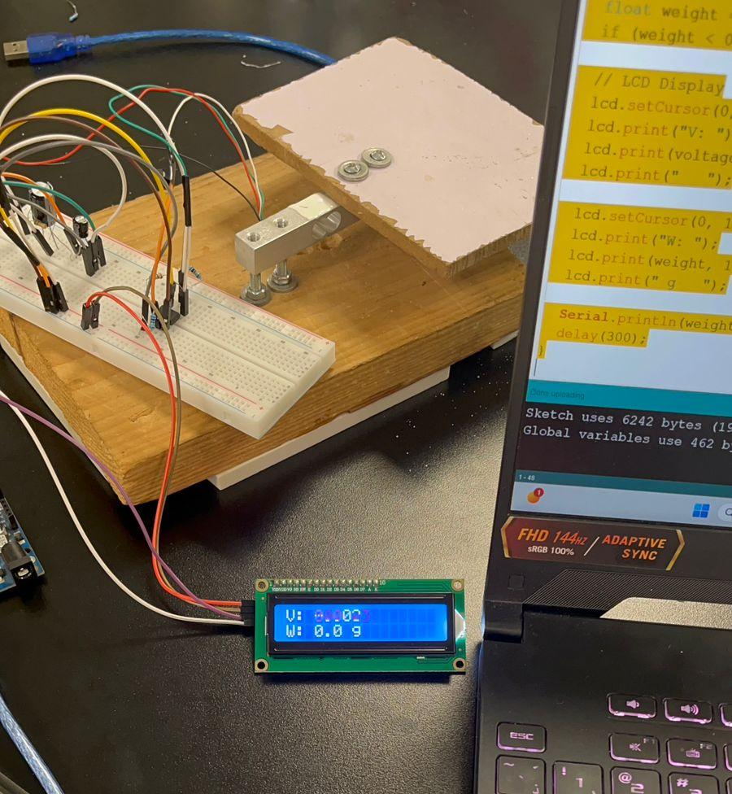

# ⚖️ Load Cell Transducer — Signal Conditioning & Weight Measurement

<div align="center">


**A strain-gauge load cell taken from raw noisy Wheatstone-bridge output to a calibrated, real-time weight readout — via bridge theory, LTspice signal-conditioning simulation, and Arduino implementation.**

</div>

---

## 📸 Project Gallery

### Sensor & Setup


### System Overview


### Wheatstone Bridge Configurations




### Signal Conditioning Circuit (LTspice)



### Filter Analysis


### Raw Data Analysis


### Final Hardware Result


---

## TL;DR

Built and characterized a **strain-gauge load cell** end-to-end: derived the Wheatstone-bridge output equations for quarter/half/full bridge configurations, simulated the raw bridge signal in LTspice to quantify noise, designed a two-stage RC low-pass filter to clean it, and implemented the full chain — amplification, filtering, and calibration — on an Arduino UNO with live LCD weight readout.

**Headline finding:** the raw bridge output is dominated by high-frequency noise (thermal, micro-vibration, power-supply ripple) riding on a stable DC baseline. A two-stage passive RC low-pass filter is sufficient to recover a clean, slowly-varying signal proportional to applied force — verified both by time-domain smoothing and FFT roll-off.

---

## Theoretical Background — Wheatstone Bridge

A strain gauge's resistance change $\Delta R$ is proportional to applied force: $\Delta R \propto \Delta L \propto F$. The bridge topology determines sensitivity.

### Quarter bridge (1 active strain gauge)

$$R_2 = R_3 = R_4 = R, \quad R_1 = R + \Delta R$$

$$V_o \approx \frac{V_i}{4}\cdot\frac{\Delta R}{R}$$

### Half bridge (2 active strain gauges)

$$R_1 = R+\Delta R,\quad R_2 = R-\Delta R,\quad R_3=R_4=R$$

$$V_o = \frac{V_i}{2}\cdot\frac{\Delta R}{R}$$

### Full bridge (4 active strain gauges)

$$R_1=R+\Delta R,\ R_2=R-\Delta R,\ R_3=R+\Delta R,\ R_4=R-\Delta R$$

$$V_o = V_i\cdot\frac{\Delta R}{R}$$

### General result

$$V_o = \frac{N}{4}\,V_i\,\frac{\Delta R}{R}, \quad N = \text{number of active strain gauges}$$

More active gauges → higher sensitivity, and a **full bridge (N = 4)** additionally cancels temperature effects, since all four gauges (same material) drift equally and the differential measurement rejects the common-mode shift. This is why the full bridge was selected for the implementation.

---

## Signal Conditioning: Filter Design

The raw bridge output ($V_o$) is amplified, then passed through a **two-stage passive RC low-pass filter** to reject high-frequency noise while preserving the slow force-proportional signal.

**Transfer function (2nd-order CR filter):**

$$G(s) = \frac{100}{s^2 + 21s + 100}$$

| Parameter | Value |
|---|---|
| Center frequency, $f_c$ | 1.5915 Hz |
| Q factor | 0.4762 |
| Damping ratio, $\zeta$ | 1.05 |
| Pole 1, $\lvert p_1 \rvert$ | 1.1616 Hz |
| Pole 2, $\lvert p_2 \rvert$ | 2.1807 Hz |

The damping ratio $\zeta > 1$ confirms the filter is **overdamped** — no ringing, monotonic settling, which is exactly what's wanted for a stable weight readout.

---

## LTspice Validation

Raw data was captured on Analog Discovery at two sampling bases (2 ms and 200 ms) and replayed into LTspice for analysis:

- **Raw signal:** dominated by high-frequency jitter and occasional spikes — consistent with thermal noise, micro-vibration, electrical interference, and supply ripple. Mean voltage is stable long-term, confirming the sensor itself functions correctly; the noise is what needed conditioning, not the sensor.
- **FFT analysis:** confirms the noise content extends well above the signal band, justifying the ~1.6 Hz cutoff chosen for the filter.
- **Filtered output (node-by-node):**
  - `n001` — large noise from the raw excitation
  - `n002` — moderate smoothing after stage 1
  - `n003` (final output) — heavily smoothed, slow response, tracking applied force cleanly

Two filter component sets were validated: $R_1=500\,\Omega,\ C_1=20\,\mu\text{F}$, $R_2=5\,\text{k}\Omega,\ C_2=2\,\mu\text{F}$ (faster base) and $R_1=5\,\text{k}\Omega,\ C_1=225.7\,\mu\text{F}$, $R_2=50\,\text{k}\Omega,\ C_2=22.57\,\mu\text{F}$ (slower base) — both confirming the cascaded two-pole passive low-pass behavior.

**Practical notes from testing:**
- Force direction matters — pressure resolves into horizontal/vertical components, so alignment with the sensor's sensitive axis was necessary for clean readings.
- Wire routing/shielding on the breadboard directly affected noise pickup; loosely covered wiring increased noise substantially.

---

## Hardware Implementation (Arduino UNO — Bonus)

The conditioned analog signal is read by an Arduino UNO, converted to a calibrated weight, and displayed live on a 16×2 I²C LCD.

```cpp
#include <Wire.h>
#include <LiquidCrystal_I2C.h>
LiquidCrystal_I2C lcd(0x27, 16, 2);
const int ampPin = A0;

// LOAD CELL CALIBRATION
const float V0 = 1.248;     // voltage at 0 g
const float scale = 1126.0; // g per volt

// FINAL CORRECTION
const float OFFSET = 229.3; // tare offset (g)
const float GAIN = 1.8;     // correction factor

void setup() {
  lcd.init();
  lcd.backlight();
  Serial.begin(9600);
}

void loop() {
  int raw = analogRead(ampPin);
  float voltage = raw * (5.0 / 1023.0);

  float weight_raw = scale * (voltage - V0);
  if (weight_raw < 0) weight_raw = 0;

  float weight = GAIN * (weight_raw - OFFSET);
  if (weight < 0) weight = 0;

  lcd.setCursor(0, 0);
  lcd.print("V: ");
  lcd.print(voltage - 1.450, 3);
  lcd.setCursor(0, 1);
  lcd.print("W: ");
  lcd.print(weight, 1);
  lcd.print(" g ");

  Serial.println(weight);
  delay(300);
}
```

The system was calibrated to zero and validated against multiple known loads, including a tare/zero-offset check to remove baseline drift.

---

## Repository Structure

```
Load-Cell-Transducer/
│
├── README.md
├── Stage_2_-_Electric_Circuits.pdf        # Bridge signal capture & raw LTspice analysis
├── Stage_3_-_Final_Report.pdf             # Theory, filter design, implementation, results
└── *.png                                  # Figures referenced in this README
```

## Skills & Topics

Strain gauge sensing · Wheatstone bridge theory (quarter/half/full) · analog signal conditioning · RC low-pass filter design · transfer function & pole analysis · LTspice simulation · FFT noise analysis · Arduino embedded implementation · sensor calibration.

## Links

- **Stage 2 Report:** [Google Drive](https://drive.google.com/file/d/1q1BhmOoy89-auXsODW4EV9orjTTpiZ_3/view?usp=drive_link)
- **All raw data, videos, and simulation files:** [Google Drive folder](https://drive.google.com/drive/folders/1PjnTA8GA8b8U_wOX9b5B9bUmk9Izyzzf?usp=sharing)

---

## 👥 Team

**Load Cell Transducer** — Electric Circuits, Zewail City of Science and Technology, Fall 2025

| Name | ID |
|---|---|
| Hassan Emad | 202401299 |
| Mohamed Khaled | 202400729 |
| Alzahraa Refaat | 202401536 |
| Amira Ibrahim | 202401172 |

**Supervised by:** Dr. Ahmed S. Abd-Rabou

---

## 📄 License

No license — educational use only.
